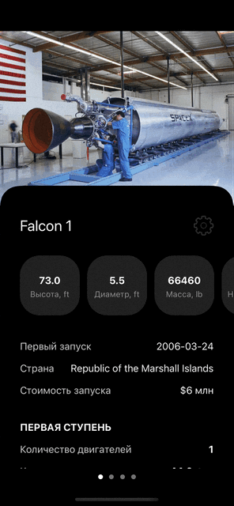
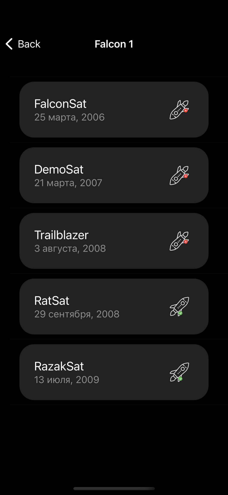

SpaceX
==========

Приложение показывает информацию о космических ракетах SpaceX и список их запусков.

Интерфейс: UIKit, UIScrollView, UICollectionView, UITableView, UIPageViewController, вся вёрстка кодом.
Работа с сетью: URLSession.
Архитектура: MVC.
API: [rockets](https://api.spacexdata.com/v4/rockets), [launches](https://api.spacexdata.com/v4/launches) .

## Screenshots

Стартовый экран приложения, на которой распологается случайное изображение космической ракеты, её наименование и вся необходимая информация. В нижней части экрана распологается кнопка "Посмотреть запуски", при нажатии на которую происходит переход на экран 2.

Экран 2. Таблица, в которой отображается название космической ракеты и список её состоявшихся запусков. По каждому запуску ракеты показываем: название, дату и иконку успешного/неуспешного запуска.

