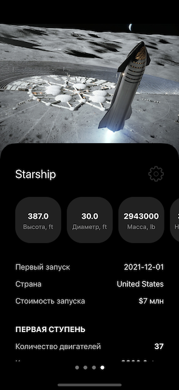
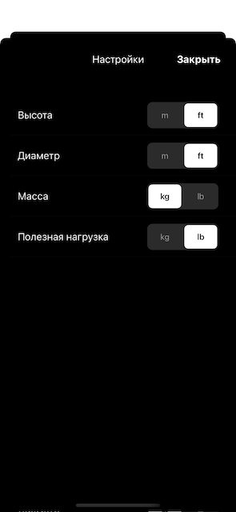

SpaceX
==========

Приложение показывает информацию о космических ракетах SpaceX и список их запусков.

* Интерфейс: UIKit, UIScrollView, UICollectionView, UITableView, UIPageViewController, вся вёрстка кодом. 
* Работа с сетью: URLSession. 
* Архитектура: MVC. 
* API: [rockets](https://api.spacexdata.com/v4/rockets), [launches](https://api.spacexdata.com/v4/launches).

## Screenshots

## Экран 1
#### Космические ракеты SpaceX
Стартовый экран приложения, на которой располагается случайное изображение космической ракеты, её наименование и вся необходимая информация. Напротив названия ракеты располагается кнопка, при нажатии на которую презентуется модально Экран 3. В нижней части экрана располагается кнопка "Посмотреть запуски", при нажатии на которую происходит переход на Экран 2.

## Экран 2
#### Список запусков космической ракеты
Таблица, в которой отображается название космической ракеты и список её состоявшихся запусков. По каждому запуску ракеты показываем: название, дату и иконку успешного/неуспешного запуска.

## Экран 3
#### Настройки
Данный экран предполагает выбор единиц измерения для следующих параметров ракет:
* высота ракеты
* диаметр
* масса
* полезная нагрузка

